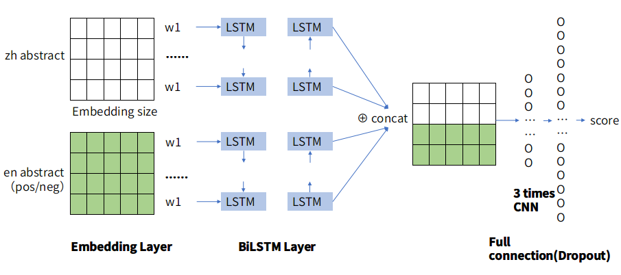

# ZJU Internship
Some done work in ZJU during the internship period. Most about neural network frame using tensorflow.

## Environment
Python: 2.7 (partly support python 3.6 )

Tensorflow: 1.0.1

## Traditional RNN Frame
### Input :
A generated sequence under some rules.
### Output :
To predict the next output.
### Model :
Traditional RNN model.

#### reference:
https://blog.csdn.net/u013082989/article/details/73469095/


## Multiple LSTM/GRU Frame
### Input :
The image of mnist.
### Output :
The classification of number from 0 to 10.
### Model :
Include traditional LSTM、traditional GRU、multiple Layer LSTM、multiple Layer GRU、traditional Bi-Directional LSTM、Multiple Layers BiLSTM model.

#### PS.:
The implement of different models using tensorflow framework.

To be familiar with the specific details of the implementation.
#### reference:
https://www.zybuluo.com/hanbingtao/note/581764

https://www.cnblogs.com/zyly/p/9029591.html

## TextCNN
### Input :
The sequence of a movie review.
### Output :
The emotion tendencies, positive or negative.
### Model :
embedding layer =>Multiple convoluted layer with max-pooling layer =>Desor layer =>Desor layer =>softmax layer

#### PS.:

1. There are two version TextCNN, you can run 
```
python run_textcnn_model_v1.py
```
or 
```
python run_textcnn_model_v2.py
```
to get different version of textcnn.

the difference is the detail implementation in these two model.

2. the training data download url for word embedding is here : http://mattmahoney.net/dc/text8.zip


## BiLSTM-TextCNN
### Aim:
To match the entities between different baidu baike and wikipedia.
### Input:
Some element of one baidu baiku entity and 100 wikipedia entity candidates.
### Output:
The wikipedia entity which has highest score.
### Model:
1. Use triple training.

2. embedding layer => bilstm layer => concat layer => textcnn layer => densor layer => score


### Result
hyper parameter| Train accuracy | Val accuracy | Test accuracy 
----|---------|--------|------
Filter number =16，Bath size =256 |96.8% |Top1：21.7% Top10：65.8% |Top1：13.5% Top10：60%
Filter number =128，Bath size =256 |100% |Top1：21.7% Top10：71.3% |Top1：17% Top10：64.4%
Filter number =64，Bath size =128 |98.4% |Top1：14.7% Top10：65.1% |Top1：14.4% Top10：60.2%
Filter number =64，Bath size =32 |100% |Top1：13.9% Top10：46.5% |Top1：9.25% Top10：48.2%

#### PS. :
The data is provided by Zhejiang University DCD lab. And this data can not be public, so i just push the model code.


## Attention-BiLSTM-TextCNN
Under the base of **BiLSTM-TextCNN**, add one attention base model layer before bilstm.But the result is not good. Compared with the previous model, the accuracy rate dropped by 10%.


## Attention mechanism for text classification tasks

Tensorflow implementation of attention mechanism for text classification tasks.  
Inspired by "Hierarchical Attention Networks for Document Classification", Zichao Yang et al. (http://www.aclweb.org/anthology/N16-1174).

### Note:
This is fork from other's.

https://github.com/ilivans/tf-rnn-attention

I edit some code to make this project can run on python 3.6.
