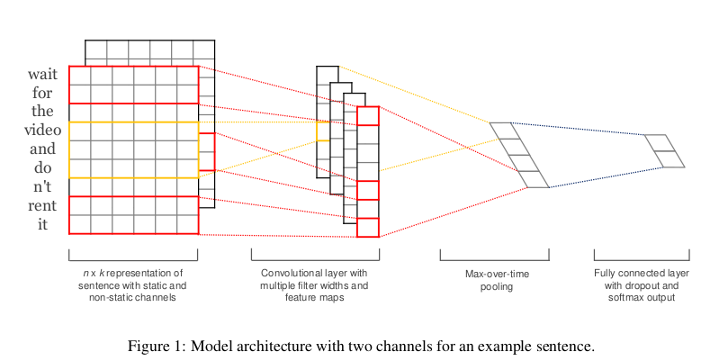
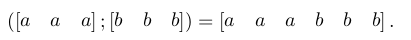
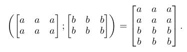
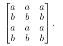
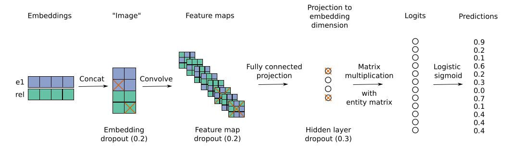
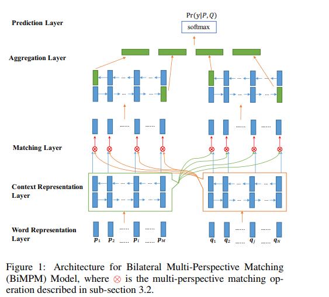
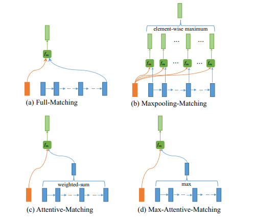

# Outline
主要会讲几篇论文的aims，background，innovation，model details，毕竟概述性质将，有兴趣的可以自己找paper看一下，数学公式或者证明的相对来说比较少。

一方面毕竟machine learning这一块本来解释性也不是很多，照着实现就行；另一方面我一两周中看的论文比较多，比较粗略，这个只是用来做一个总结记录。

里面有几篇我是有相关的实现，或者是参考其中一部分实现在我其他的模型上的。Github地址：https://github.com/NullAerber/ZJU_Internship

第一篇主要是针对NLP任务的一些比较出色的典型Model
1. （TextCNN）Convolutional Neural Networks for Sentence Classification
2. Convolutional 2D Knowledge Graph Embeddings
3. Bilateral Multi-Perspective Matching for Natural Language Sentences

# (TextCNN）Convolutional Neural Networks for Sentence Classification
## Aims
众所周知，CNN神经网络在计算机视觉方面(Krizhevsky et al., 2012)和语音识别(Graves et al., 2013)表现很出色，这是因为CNN可以提取local feature的能力很强。

所以作者就想说，NLP中也有这样的任务是需要提取相关的局部特征的，CNN正好提供了这样优秀的能力，反倒是LSTM、GRU这种的可能就不是很适合。因此尝试着用一层卷积层来做分类任务。

## Innovation
提出将CV中的CNN的模型运用在NLP中。

## Model
整个模型十分的简单。
一层embedding，一层CNN，一层full connection，做分类的话最后还有一层softmax。

和普通的CNN的区别有2点：
1. 就图上而言，普通做CV的CNN是图像长度x图像宽带xRGB三色通道的，然而对于序列来说，一方面图像宽度是固定的，是每个词的word embedding，另一方面是word embedding中的每一个数值都是最小单位，所有句子所构成的这个图是只有一个通道的，不像图片是有RGB三通道，或者是带透明四通道的。
2. 一般做TextCNN的时候卷积核的大小会选择和embedding size 一样大，原因是embedding代表的是一个词在文字向量空间位置综合体现，embedding中的每一个数值单独进行操作都是没有实际意义的。

## Implemention
**具体实现：[TextCNN](https://github.com/NullAerber/ZJU_Internship/tree/master/TextCNN)**

**输入:**

影评文字

**输出:**

情感倾向，正面评价还是负面评价。

**PS.:**

这边我提供了两种的TextCNN的实现方式，一种比较简单易明白，另一种比较难看懂，但是更加灵活。

同时word embedding那一块训练的预料是Google的text8，[下载地址在这](http://mattmahoney.net/dc/text8.zip)。word embedding训练的代码也已经在代码中写好了。

# Convolutional 2D Knowledge Graph Embeddings
上一篇CNN在NLP中表现的还算不错，因此后面有人想到用CNN延伸到Knowledge Graph（KG）中。甚至最近机器之心发了一篇推文说CNN基本上已经可以取代RNN的一系列模型。
## Aims
在许多的大型知识图谱中，实体一般比较齐全，但是实体和实体之间的关系则相对来说比较少，缺少度比较大，一些关系人类是可以通过一定的推理和解析得到的。但是由于现实实体之间的关系千千万万种，目前机器不可能通过硬规则实现。因此考虑通过CNN的方式学习相关的实体关系链路。

## Innovation
1. 该模型的主要特点是通过2D embedding CNN来得出分数。

    **对于这个2D的解释，我们可以先简单理解为将一维的embedding通过复制、交互进行维数拓展。**

    接下来我们进行详细的解释。
    
    使用2D而不是1D增加了模型通过embedding之间的附加的相互作用的表达性。例如，考虑concat两行1D embedding，a和b的shape为[m,n] = [1,3]：
    
    
    在这种情况下，filter size为k = 3的过滤器可以获取到a和b之间的交互。

    那么如果采用堆的方式进行对embedding进行复制，例如此时a和b的shape为[m,n] = [2,3]:
    
    
    此时，filter size为k = 3×3的2D卷积将能够模拟整个级联线周围的相互作用（与n和k成比例的相互作用的数目）。

    甚至可以采用其他交替模式，例如：

    
    
    在这种情况下，2D卷积运算能够模拟a和b之间的更多相互作用（具有与m、n和k成比例的相互作用的数目）。因此，与1D卷积相比，2D卷积能够提取两个嵌入之间的更多特征交互。

2. 不同于采取实体对和关系作为三重（e1，rel，e2）的其他链路预测模型和得分方式（1-1 score），此文章采取（e1，rel）二元组的方式，并且得分为（1-N score）。

    1-1 score的意思是一个sample只有一个分数，即(e1,rel,e2)三者限定出的一个分数。

    1-N score则是一个sample会有N个分数，即(e1,rel)两者同N个e2候选者之间进行计算得到的N个分数。

    下图的模型可以解释的更清晰。

## Model

1. Embedding layer：将（实体，关系）对的两者分别进行embedding得到其向量。
2. Concat：将embedding后的(e1,rel)从1D扩充到2D，用innovation中的提到的几种拓展方式进行拓展。
3. CNN：普通CNN layer。
4. Full connection： 普通的全连接层。
5. Logits：将full connection后得到的值和需要预测的tail实体candidates矩阵进行矩阵相乘。就是full connection的结果乘上候选实体的embedding矩阵得到值。
6. Predict score： 得到最终的预测结果，根据分数高低，在candidates中得出最终和此(e1,rel)相匹配的e2。

# Bilateral Multi-Perspective Matching for Natural Language Sentences
## Aims
为了针对NLP文本匹配任务在传统的RNN，CNN是单向匹配、交互方式单粒度的弊端，提出了双向多粒度匹配模型（BIMPM Model）

## Innovation
1. 双向匹配
    在一般的文本匹配问题中，一般都是A匹配B，或者是B去匹配A，而不是两者进行交互，相互进行匹配。因此在本文中采用了A against B，同时B against A的形式。

2. 多粒度
    在一般的文本匹配问题中，都是word和word之间或者sentence和sentence之间进行交互，很少有小粒度和大粒度之间的交互。在此文中则体现了word和sentence之间的交互。

## Model

1. word embedding layer： 普通的embedding layer。
2. Context representation layer： 将embedding layer的结果输入到BiLSTM中。
3. Mathcing layer： 这一层重点体现了前面的innovbilstmation。
    首先，bilstm得到隐藏状态hidden states（图中向上的箭头），最终状态final states（bilstm最终引出的）。
    
    其次，hidden states代表的还是word粒度，final states代表的则是sentence粒度。两者在红色的x(multi-perspective matching operation)进行了多粒度交互。这种多粒度交互的方式也有四种：
    
    
    分别是full-matching(取final state)、maxpooling-matching（取最大值）、attention-matching（做attention取值）、max-attention-matching（attention后取最大）。

    然后，双向匹配体现在，上述的多粒度交互不仅仅是P对Q进行，Q也会对P进行，图中体现的比较清楚。

    最终输出双向多粒度匹配的结果。
4. Aggregation layer： 对于双向多粒度匹配的结果再进行BiLSTM，并将得到的四个final states（P的正向、反向2个，Q的正向、反向2个）取出进行concat。
5. Prediction： 将上一层的结果输入softmaxs输出预测结果。