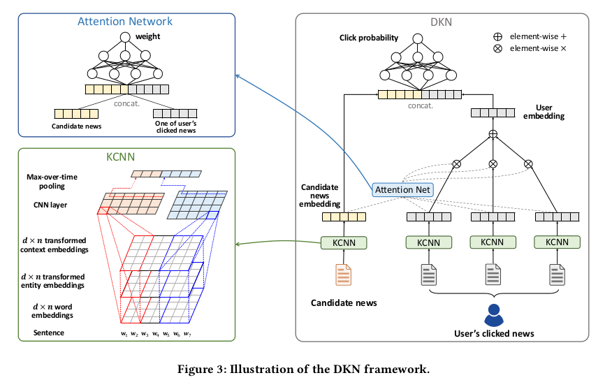
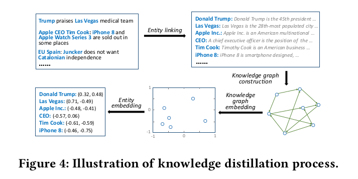
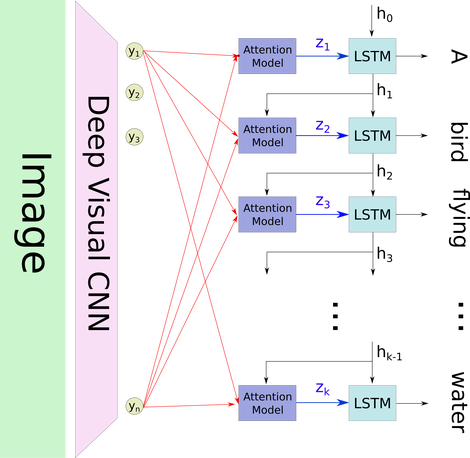
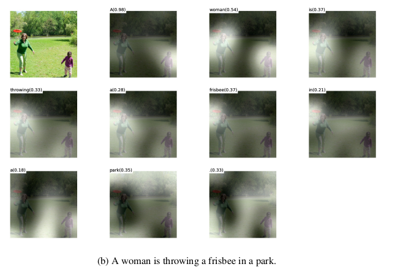

# Outline
上一篇主要挑了几篇针对NLP任务的一些比较出色的典型Model，把Model details写了一下。

这次主要是Attention Based Model，注意力机制模型。

Attention需要最先说明的就是，Attention Based Model并不算是一种实实在在的类似CNN或者RNN这种的模型，它应该算是一种机制。所以有时候会叫做Attention Mechanism，是通过一种加权重或者max pooling等的方式对输入的某些部分给以不同大小的系数，以达到不同程度的关注度。

部分实现代码：Github地址：https://github.com/NullAerber/ZJU_Internship

此文中会涉及到的论文：
1. Hierarchical Attention Networks for Document Classification
2. DKN: Deep Knowledge-Aware Network for News Recommendation
3. Show, Attend and Tell: Neural Image Caption Generation with Visual Attention

# Hierarchical Attention Networks for Document Classification）
## Aims
利用Attention Mechanism去做文档分类。

## Innovation
1. 提供层次结构, 反映文件中word，sentence两个粒度的层次结构。
2. 对两个粒度做Attention Mechanism, 分别是word粒度和sentence粒度, 使其能够在构建文档表示时，对不重要和重要的内容进行差异化表示。

## Model

1. word embedding layer：首先在word粒度进行embedding。
2. word encoder layer： 采用双向GRU得到隐藏状态。
3. word attention： 

    用attention Mechanism将上一层从双向GRU得到的隐藏状态同需要被关注的对象u进行交互。
    
    这里的交互是普通的矩阵相乘->softmax->矩阵求和。同时这个矩阵求和的维度是以句子的长度而定，会把原本是一个句子的词，在通过以上几层网络的操作后加起来得到sentence embedding。
    
    需要注意的是u是通过word embedding经过一层MLP（Multi-Layer Perceptron多层感知器）得到的。
4. sentence embedding layer： 在上一层输出中得到句子的sentence embedding。
5. sentence encoder layer： 同样采用双向GRU得到隐藏状态。
6. sentence attention： 与第3层的word attention的机制相似。最终得到context粒度的表达。
7. softmax： 对context embedding进行softmax得到最终分类得分。

## Implemention
**具体实现：[Attention mechanism for text classification tasks](https://github.com/NullAerber/ZJU_Internship/tree/master/Attention_Text_Classification)**

fork别人得到。修改了部分代码以使用Python3.6。

# DKN: Deep Knowledge-Aware Network for News Recommendation
## Aims
本文提出了 DKN 模型，将知识图谱表示融入新闻推荐中。DKN 是一个基于内容的点击率的深度推荐模型。

## Innovation
1. 引入融合语义水平和知识水平的知识感知卷积神经网络（KCNN）。
2. KCNN将word、entity、context这三个粒度当成三通道，采用卷积的方式，卷积过程中保持这三者的对齐。

## Model

1. DKN 的输入包括候选新闻（标题），通过 KCNN 提取特征得到 embedding 表示，相较传统的 CNN，KCNN 可以融合知识图谱中的信息，来得到一个更好的句子表示。

2. 对用户点击的历史新闻（标题）如法炮制，得到历史新闻的 embedding，结合 Attention 机制同候选新闻计算权重后加权，得到用户的 embedding。

3. 将候选新闻的 embedding 和用户 embedding 拼在一起，通过一个几层full connection，最终计算点击的概率。

其中关于融合知识图谱、Entity embedding、context embedding的可以参考下面这个reference和原文。附上这两种embedding的图示：
 

## Reference
[结合知识图谱中的表示学习，加上神经网络，进行新闻推荐。](https://qiufengyu.github.io/2018/04/17/reading14/)

## Extend
1. Bahdanau D, Cho K, Bengio Y. Neural Machine Translation by Jointly Learning to Align and Translate[J]. Computer Science, 2014.
2. Seo M, Kembhavi A, Farhadi A, et al. Bidirectional Attention Flow for Machine Comprehension[J]. 2016.

# Show, Attend and Tell: Neural Image Caption Generation with Visual Attention
## Aims
生成图片描述。

## Innovation
在image caption中使用了attention mechanism，使得caption生成更加完美和贴切。同时文章采用了可视化的方式表示了在生成每一个词的时候，模型在图像上的注意区域。

## Model

1. Deep Visual CNN：用VGG19预先训练好的模型得到每张图片的特征。
2. Attention Mechanism： 将得到的所有图片特征，依次都输入到attention cell中。Attention中的图示参考下图：

同时此文还采用了soft attention和hard attention两种，result会展示两者在可视化上的区别，具体的数学表达式可以参考reference中**深度解析注意力模型(attention model) --- image_caption的应用**的描述。
3. LSTM output layer： 按照设置的最长sequence length，LSTM依次接收attention输出的结果，通过LSTM得到相应的word，并将此输出传递给下一个LSTM。

## Result
此文的另一个特点就是用可视化的方式表示了在生成每一个词的时候，模型在图像上的注意区域。

## Reference
1. [tensorflow复现github 地址](https://github.com/yunjey/show-attend-and-tell)
2. [深度解析注意力模型(attention model) --- image_caption的应用](https://segmentfault.com/a/1190000011744246)
3. [heuritech.com - ATTENTION MECHANISM](https://blog.heuritech.com/2016/01/20/attention-mechanism/)
4. [浅谈Attention-based Model【原理篇】](https://blog.csdn.net/wuzqchom/article/details/75792501)
