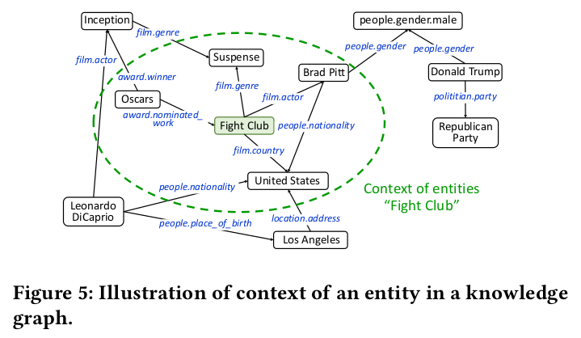

# Outline
在浙江大学实习的课题是“跨语言的实体融合”，但是最后只做了对齐，还没有涉及到融合的方面。此文主要记录一下在实习阶段自己做的一些model、result还有future work。

主要分为以下几大板块：
1. Introduction
2. Model Details
3. Related Work
4. Future Work
5. Reference

# Introduction
## Background
在知识图谱中有三大任务，其中有一个就是**共指消解**[1]，指的是将不同形式，但是是指向同一项实体的表示对齐。我们的课题“跨语言的实体对齐”就是其中一种，是对齐用不同语言指代的同一种实体，例如“apple phone”和“苹果手机”其实指的是同一样东西。对齐在知识融合中具有很大的基础价值，一旦实体对齐之后，才能很好的将两种或者多种不同语言、媒体的知识进行相互的补充和融合。

## Data
数据来自**浙江大学DCD实验室 鲁伟明教授小组**。

## Aims
对于一个中文百度百科实体，在100个候选Wikipedia中找出其对应的相同指代实体。

我们采用多种深度学习模型，输出计算后的候选者分数，分数越高说明越有可能是和中文对应的实体。我们设立了top1（前1名准确率）和top10（前10位准确率）最为衡量模型优劣的标准。

# Model Details
在浙大的时候我尝试了2种模型，一种是**BiLSTM+CNN**，一种是**Attention+BiLSTM+CNN**。前者效果比较好，最高top1是17%，top10是64.4%。
## BiLSTM+CNN
### Model

模型整体比较简单。需要说明的是，训练的时候采用的是三元组的训练方式，为（中文实体，英文正例实体，英文负例实体）。

**先讲一下训练模型：**
1. embedding layer

    将百度百科和两个Wikipedia的摘要转换为embedding，得到三个[embedding size, sequence length, 1]的矩阵。

2. bi-lstm layer

    将前面一层得到的embedding数据，依次喂入到Bi-LSTM中。Bi-LSTM的数量为sequence length。
    
    此层最终保留Bi-LSTM的hidden outputs，输出三个[sequence length, lstm hidden size * 2]的摘要表达。

3. concat layer

    将前一层得到的中文实体摘要表示和英文正例、负例摘要表示分别在第二维上进行连接。

    即concat（[hiddens_zh, hiddens_pos]），concat（[hiddens_zh, hiddens_neg]），得到两个[sequence length, lstm hidden size * 4]中英文交互表达。

    为了输入到CNN中，在扩充了最后一维，表示1通道。

    即此层最终输出两个[sequence length, lstm hidden size * 4，1]向量。

4. cnn layer

    将上一层的输出，通过一层或者多层CNN+max pooling（通过cnn_layer_size_list参数动态调整）得到输出n个cnn output，输出大小根据参数变化。

    在实验的过程，我采用3层cnn，kernel size分别为[3,4,5]时效果最好。

5. full connection layer

    首先将上一层得到的n层CNN输出全部concat，并且reshape成一个一维的矩阵。

    在这个一维矩阵上采用带L2正则化的full connection，分别得到postive的分数和negative的分数。

6. loss + optimizator

    设定magrin，计算loss和accuracy。并采用AdamOptimizer。

**预测模型**

同训练模型类似，只是在预测模型中，我们是将需要预测的中文实体和100个候选者依次以（中文实体，正例实体）的方式结对放入模型中，而不放入负例。

通过整个模型之后，输出100个候选者的分数，计算top1和top10的准确率。

### Model Result
hyper parameter| Train accuracy | Val accuracy | Test accuracy 
----|---------|--------|------
Filter number =16，Barch size =256 |96.8% |Top1：21.7% Top10：65.8% |Top1：13.5% Top10：60%
Filter number =128，Barch size =256 |100% |Top1：21.7% Top10：71.3% |Top1：17% Top10：64.4%
Filter number =64，Barch size =128 |98.4% |Top1：14.7% Top10：65.1% |Top1：14.4% Top10：60.2%
Filter number =64，Barch size =32 |100% |Top1：13.9% Top10：46.5% |Top1：9.25% Top10：48.2%

## Attention+BiLSTM+CNN
在第一个模型的基础上，在参考了[2]的attention机制之后，在embedding layer和bi-LSTM layer之间加了一层attention。如下图:

其中attention的细节图如下两张：

下图是每一个attention的内部结构图:

### Model Result
修改后的模型效果并没有改进，在Filter number =128，Barch size =256 的条件下，测试集上最好的结果也只是top1：12%，top10: 46%。

# Related Work
 **陈璐 @ 中山大学** 复现了 **Convolutional Neural Networks for Soft-Matching N-Grams in Ad-hoc Search**，并应用到此课题上。

 **郭悦 @ 中山大学** 复现了 **Bilateral Multi-Perspective Matching for Natural Language Sentences**。同时基于此论文，将最后一层LSTM换成CNN后，将准确率提高了8%。

 Model| Train accuracy | Val accuracy | Test accuracy 
----|---------|--------|------
Conv-K-NRM|100% |Top1：35% Top10：85% |Top1：29% Top10：73.8%
Bi-MPM+CNN |100% |Top1：25.7% Top10：72.0% |Top1：27% Top10：72.9%

# Future Work
在同组内其他同学的对比之后，觉得自己的模型的准确率有点低。因此考虑一些改进措施。

## 图片Attention做补充

上图是文章[3]中提出的基于attention的图片字幕生成模型。下图是模型在某一个测试图片上的可视化表示：

借助文章中对于图片采用attention mechanism生成字幕的方法，我们可以利用此方法提取某一个中文百科对应的多张图片的比较general的图片描述。再利用这种图片描述，对摘要或者标题进行一个attention的辅助，或者直接只用图片做对齐。

下图是当此图片描述作为其他模型的attention的辅助的模型描述：

模型解释：

1. 首先将某一个百科或者Wikipedia的图片通过论文中提出的模型（即图中上半部分的模型）得到某一张百科/Wikipedia的图片描述。

    然后将百科和postive，百科和negative分别在第三维上concat，变成2通道的矩阵。

    在2通道数据的基础上，通过一层或多层CNN得到结对交互表示。

2. 取出我前面提出的BiLSTM+CNN中的CNN layer后的输出表示为X，将得到的（百科，postive），（百科，negative）的结对表示，在数据X上做attention mechanism。

3. 最后将attention mechanism的输出通过一层或多层全连接得到最终分数。

模型弊端：

1. 此方法的弊端一，文章[3]模型的方法是否具有较高的普适性，对于我们百度百科/Wikipedia的图片数据，是不是会出现比较大的噪声。

2. 第二个问题，因为我曾经在实验室的服务器上跑过[此论文的复现](https://github.com/yunjey/show-attend-and-tell)，但是最终以oom的报错没有跑出结果。所以可能如果需要尝试的话，可能需要升级服务器配置。

3. 第三个问题就是在[论文的复现](https://github.com/yunjey/show-attend-and-tell)中，最终输出是one hot编码，如果用word embedding来训练会比较好，这样相当于是从图片向量空间转换到文字向量空间中，这样方便去补充到过去一些通过NLP手段做对齐的模型中。

## 多粒度表示
在文章[4]的启发下，考虑到能否采用多粒度的表征进行学习。即不仅有word embedding，还有sentence embedding，甚至可以context embedding去做分层化的学习。

这样的话，模型会提供层次结构, 反映文件中word，sentence两个粒度的层次结构。

同时是在多个粒度上分别做Attention Mechanism, 使其能够在构建文档表示时，对不重要和重要的内容进行差异化表示。

**此方法的可行度较高，但是数据预处理那一块可能需要做一个简单修改。**

## KCNN（knowledge-aware convolutional neural network）

虽然这篇文章[5]的方向是news recommendation，不是知识图谱，但是在论文中他利用KG去对news recommendation做补充而提出的KCNN（knowledge-aware convolutional neural network）却有借鉴意义。

全文的推荐模型如下：

我们主要关注的是KCNN这一块，其他的部分都是比较常规的模型搭建方法。其他部分的讲解可以看[这个详细说明](https://qiufengyu.github.io/2018/04/17/reading14/)

KCNN模型同样也体现出了多粒度这么一个概念，从word embedding到entity embedding，再到context embedding，但是不同于文章[4]中提出的entity embedding是由word embedding得出，context embedding是由entity embedding得出这种机制，在这篇论文中，这三个粒度之间的交互并不强。

**三种粒度的表示：**

word embedding是普通的生成方式。

而entity embedding是由下图这种图的方式进行构建：提取相关文本中的实体，构建知识网络，再降维到二维空间，得到每一个涉及到的实体的向量表达。

context embedding则是由下图方式得到：也是提取实体，构建知识网络，并按照一定的依据划分出context embedding。

**此方法的个人想法**

这个方法比较创新，因为本来此论文就是今年1月份发表的。

但是要从此入手的话，比较费时费力，因为从前的在数据集上的工作的可能并不能做一个很好的重用，而且entity embedding和context embedding的构建也比较麻烦。

如果能和上交或者微软研究所那边的老师进行联系，得到相关数据的支持，可能会方便一点。

# Reference
1. 刘峤, 李杨, 段宏,等. 知识图谱构建技术综述[J]. 计算机研究与发展, 2016, 53(3):582-600.
2. Yang Z, Yang D, Dyer C, et al. Hierarchical Attention Networks for Document Classification[C]// Conference of the North American Chapter of the Association for Computational Linguistics: Human Language Technologies. 2017:1480-1489.
3. Xu K, Ba J, Kiros R, et al. Show, Attend and Tell: Neural Image Caption Generation with Visual Attention[J]. Computer Science, 2015:2048-2057.
4. Yang Z, Yang D, Dyer C, et al. Hierarchical Attention Networks for Document Classification[C]// Conference of the North American Chapter of the Association for Computational Linguistics: Human Language Technologies. 2017:1480-1489.
5. Wang H, Zhang F, Xie X, et al. DKN: Deep Knowledge-Aware Network for News Recommendation[J]. 2018.